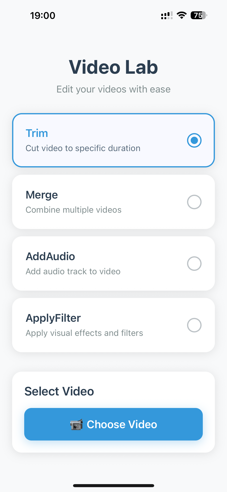

# react-native-video-lab

Small, fast, native helpers for common video edits in React Native:

✂️ Trim a clip by time range

➕ Merge multiple clips into one

🔊 Add/replace audio track on a video

🎨 Apply filters (Sepia, Monochrome, Invert)

Works with file URLs (file:///...) and Android content:// URIs.



## Installation

```sh
npm install react-native-video-lab
# iOS
cd ios && pod install && cd ..
```

## Quick start

```js
import {
  trim,
  merge,
  addAudio,
  applyFilter,
  type Filter,
} from 'react-native-video-lab';

// TRIM (seconds)
const out1 = await trim(videoUri, /* start */ 1.0, /* end */ 9.5);

// MERGE
const out2 = await merge([videoUri1, videoUri2, videoUri3]);

// ADD / REPLACE AUDIO
// mode: 'replace' (replace original) | 'mix' (keep original + overlay) — see notes below
const out3 = await addAudio(videoUri, audioUri, 'replace');

// FILTER
const filter: Filter = 'sepia'; // 'sepia' | 'mono' | 'invert'
const out4 = await applyFilter(videoUri, filter);
```

All methods return a local file URI string (e.g. file:///.../xxxx.mp4) you can pass to `<Video />` players or upload.

## API

### `trim(path: string, startSec: number, endSec: number): Promise<string>`

Cuts the segment [startSec, endSec] from path and returns a new mp4.

### `merge(paths: string[]): Promise<string>`

Concatenates clips in order. Video and audio tracks are appended sequentially.

**Tip:** For mixed orientations/codecs, re-encode clips before merging to keep playback solid across devices.

### `addAudio(videoPath: string, audioPath: string, mode: 'replace' | 'mix'): Promise<string>`

- **replace:** replace the video's original audio with the provided audio (trimmed to video duration).
- **mix:** keep original audio and mix the new audio underneath (if mixing isn't available on your platform, it will fall back to replace).

**Audio formats:** Prefer AAC (.m4a) for maximum device compatibility.

### `applyFilter(path: string, filter: Filter): Promise<string>`

Applies a color effect and re-encodes the video.

```ts
export type Filter = 'sepia' | 'mono' | 'invert';
```

- **iOS:** Core Image / AVFoundation
- **Android:** MediaCodec + OpenGL (OES texture) pipeline

## Usage examples

### With a picker

You can use any picker that returns a URI. For example:

```js
import { launchImageLibrary } from 'react-native-image-picker';
import { trim, applyFilter } from 'react-native-video-lab';

const pickVideo = async () => {
  const res = await launchImageLibrary({ mediaType: 'video' });
  const uri = res.assets?.[0]?.uri;
  if (!uri) return;

  const trimmed = await trim(uri, 0, 5);
  const filtered = await applyFilter(trimmed, 'mono');
  // use `filtered` with your player
};
```

### With Android content:// URIs

You can pass the content:// string directly; the module resolves it internally. No need to copy to a temp file yourself.

## Platform notes

### iOS

Add descriptions to your Info.plist if you access the Photo Library:

- `NSPhotoLibraryUsageDescription`

AVFoundation handles rotation metadata—playback respects the original orientation.

### Android

**Permissions (Android 13+ / 33+):**

```xml
<!-- AndroidManifest.xml -->
<uses-permission android:name="android.permission.READ_MEDIA_VIDEO" />
<uses-permission android:name="android.permission.READ_MEDIA_AUDIO" />
```

**(Android 12 and below):**

```xml
<uses-permission android:name="android.permission.READ_EXTERNAL_STORAGE" />
```

**Recommended codecs:**

- Video output: H.264/AVC in MP4 container
- Audio input: AAC (audio/mp4a-latm). MP3 may work but AAC is safest.

**Even dimensions:** some hardware encoders require even width x height. The module enforces this; odd sizes are rounded down by 1px if needed.

**DocumentsUI / Pickers:** If you see ActivityNotFoundException when picking audio, install a file manager/Docs app or use a maintained picker package.

## Troubleshooting

### IllegalArgumentException during filter/encode

Ensure the device has an H.264 encoder and your input dimensions are > 0 and even. Using extremely large frames can cause hardware encoders to reject configuration.

### Audio added but output duration equals audio length

The module clamps audio to video duration. If you still see mismatches, confirm the input videoPath has a valid duration and isn't a stream with zero durationUs.

### Malformed sample table (stbl) when playing the output

This usually means the input was malformed or a prior tool wrote a broken MP4. Re-encode the input first, then run the edit.

### Can't open content://...

Make sure the URI is valid and accessible (not revoked). If you obtained the URI from a picker, don't persist it across app restarts without taking persistable permissions.

## Roadmap

- Volume controls & fade in/out for addAudio('mix')
- More filters (brightness/contrast, LUTs)
- Text & image overlays
- Transcode helpers (resize, bitrate, fps)

## Contributing

- [Development workflow](CONTRIBUTING.md#development-workflow)
- [Sending a pull request](CONTRIBUTING.md#sending-a-pull-request)
- [Code of conduct](CODE_OF_CONDUCT.md)

PRs that add small, well-tested native helpers are very welcome!

## License

MIT

---

Made with [create-react-native-library](https://github.com/callstack/react-native-builder-bob)
